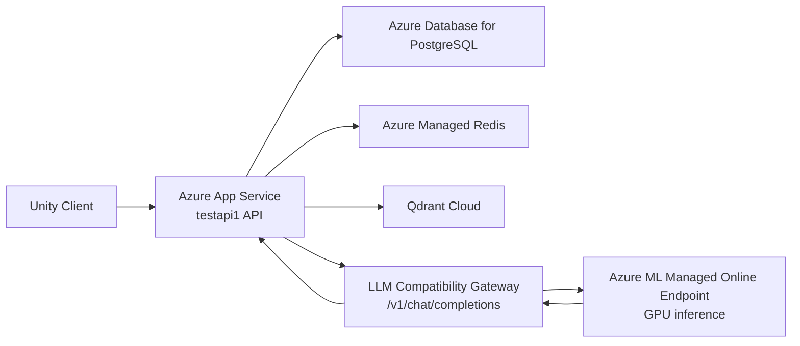

# Azure Production Architecture

This note complements the main deployment report and captures the two most important system flows: online inference and offline fine-tuning.

## Online Serving Topology

### Component Responsibilities

| Component | Responsibility |
| --- | --- |
| Unity client | Sends gameplay start, clue click, and dialogue turn requests |
| Azure App Service | Hosts the ASP.NET Core API and orchestration logic |
| PostgreSQL | Authoritative progression and runtime persistence |
| Redis | Shared cache for multi-instance deployments |
| Qdrant Cloud | Semantic retrieval and vector-backed intent context |
| LLM compatibility gateway | Keeps the API's current OpenAI-style request/response contract stable |
| Azure ML online endpoint | Runs the fine-tuned model on GPU-backed managed compute |

## Offline Fine-Tuning And Promotion Flow

```mermaid
flowchart LR
    Logs["Conversation Logs<br/>QA Transcripts<br/>Authored Examples"] --> Storage["Azure Blob Storage / ADLS Gen2"]
    Storage --> Ingest["AML Pipeline<br/>Data Ingest"]
    Ingest --> Sanitize["AML Pipeline<br/>Sanitize"]
    Sanitize --> Curate["AML Pipeline<br/>Curate Train/Val/Test"]
    Curate --> Train["AML Pipeline<br/>GPU Fine-Tune"]
    Train --> Evaluate["AML Pipeline<br/>Evaluation + Regression Checks"]
    Evaluate --> Registry["Azure ML Registry"]
    Registry --> Staging["Staging Online Endpoint"]
    Staging --> Approval["Manual Approval Gate"]
    Approval --> Prod["Production Online Endpoint"]
```

## Promotion Rules

- No model is promoted directly from training to production.
- The evaluation step must compare the candidate against the current production baseline.
- A human approval gate is required before moving from staging to production.
- At least one previous production deployment remains available for rollback.

## Repo Artifacts That Support This Architecture

- [docs/azure-production-deployment-report.md](/C:/Users/ysharma1/source/repos/testapi1/docs/azure-production-deployment-report.md)
- [appsettings.Production.json](/C:/Users/ysharma1/source/repos/testapi1/appsettings.Production.json)
- [ml/pipelines/retrain.yml](/C:/Users/ysharma1/source/repos/testapi1/ml/pipelines/retrain.yml)
- [ml/endpoints/README.md](/C:/Users/ysharma1/source/repos/testapi1/ml/endpoints/README.md)
